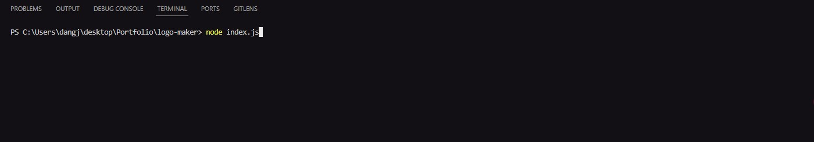
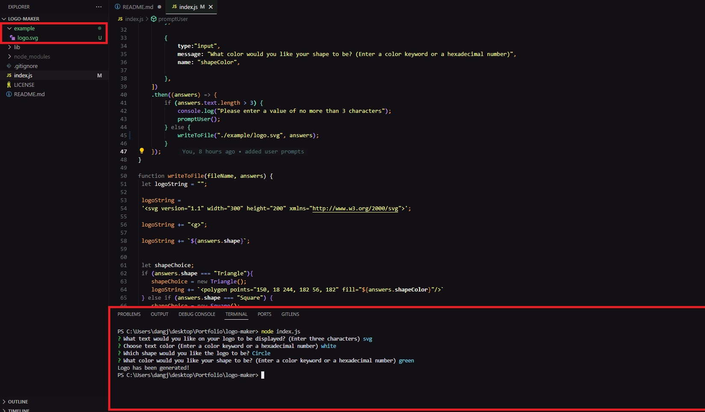
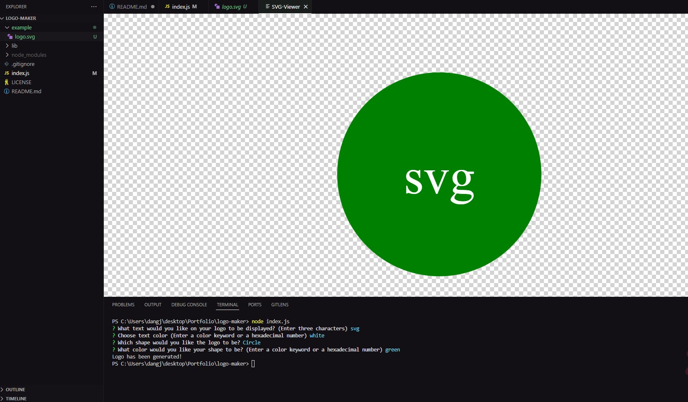
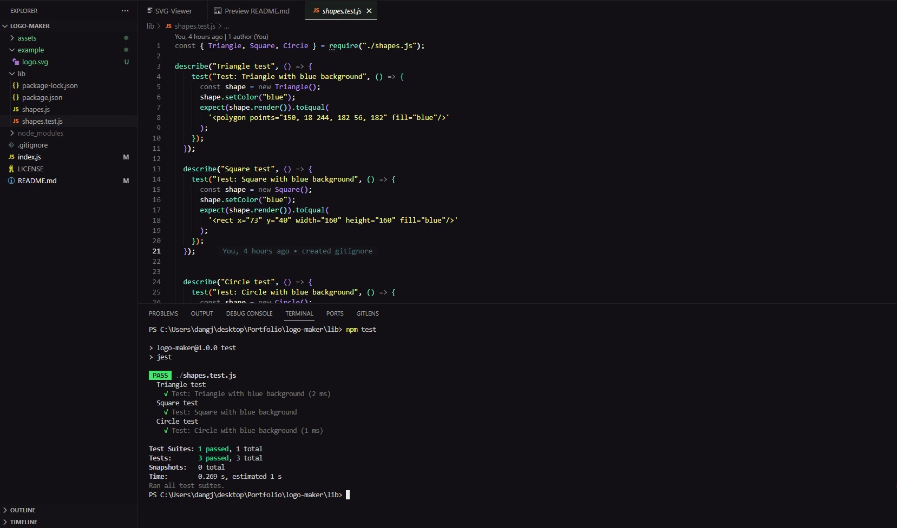

# logo-maker

## Description

The purpose of this project is to generate an svg file of a logo using markdowns. Using inquirer to retrieve data from the user, they will be asked a series of prompt which leads to a svg file with a logo generated with user prompts. 

## Installation

Node and Jest installation will be required in order to run this in your integrated terminal. After you have cloned the repo, you will run 'npm init -y', 'npm install inquirer8.2.4 to install necessary dependencies and 'npm test' to test the units for Jest. You can also download an extension called "SVG-Viewer" by Dheovani that helps see the svg file in VSCode.

## Usage

In your terminal, run 'node index.js' and answer the prompts. Once you have answered the prompts, a file will be created in the "example" folder. This will be your new generated logo svg file. If you do not answer the prompt or accidentally click enter, you will be prompted "Please enter a value of no more than 3 characters" to answer the prompts stated. You can view a quick demo [here](https://watch.screencastify.com/v/h7VUCER5dMf0nPZaOqcx)

Here is a step by step screenshot of what you will be seeing such as the prompts, where the file should be saved to, and the logo svg file when previewed. 

**Step 1:**

**Step 2:** 

**Step 3:**

**Shape testing** 

## Credits

Credits to Dheovani who created the SVG-Viewer to be able to see the logo in VSCode.  

## License

Refer to the license in the GitHub repo